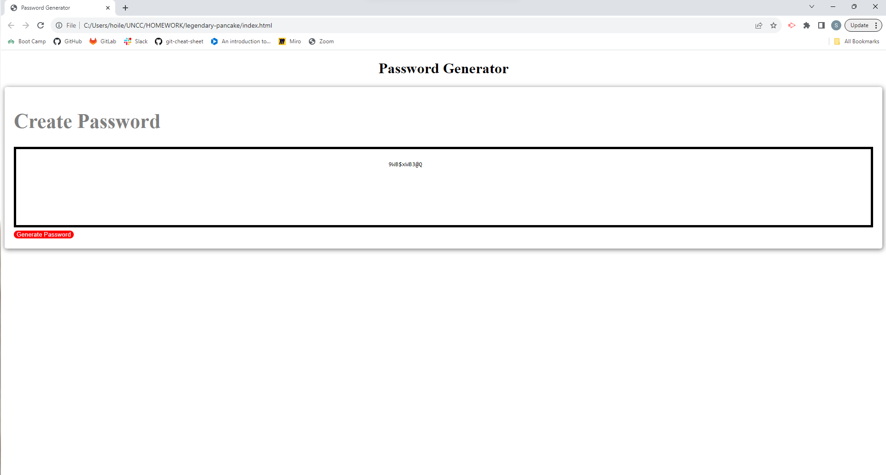

# Password Generator

## My Task 
This week's Challenge requires you to modify starter code to create an application that enables employees to generate random passwords based on criteria that they’ve selected. This app will run in the browser and will feature dynamically updated HTML and CSS powered by JavaScript code that you write. It will have a clean and polished, responsive user interface that adapts to multiple screen sizes.

## User Story
AS AN employee with access to sensitive data
I WANT to randomly generate a password that meets certain criteria
SO THAT I can create a strong password that provides greater security

## Acceptance Criteria
GIVEN I need a new, secure password
WHEN I click the button to generate a password
THEN I am presented with a series of prompts for password criteria
WHEN prompted for password criteria
THEN I select which criteria to include in the password
WHEN prompted for the length of the password
THEN I choose a length of at least 8 characters and no more than 128 characters
WHEN asked for character types to include in the password
THEN I confirm whether or not to include lowercase, uppercase, numeric, and/or special characters
WHEN I answer each prompt
THEN my input should be validated and at least one character type should be selected
WHEN all prompts are answered
THEN a password is generated that matches the selected criteria
WHEN the password is generated
THEN the password is either displayed in an alert or written to the page

## Mock Up
I need to develop a secure password using various numbers, letters (upper and lowercase) and special characters. These questions are in appear as prompts for each criteria. First, you can choose how long your password will be within our parameters. Then, you may choose which characters will be used. Finally your password will be displayed.

## Technologies Used
I used CSS and HTML for this project in order to build and style this website. After that, I used JavaScript to randomize the password characters and upload them to the generator.

## Links
GitHub Repo: [https://github.com/spencer1227/legendary-pancake]

Deploy: [https://spencer1227.github.io/legendary-pancake/]

## Screenshot

